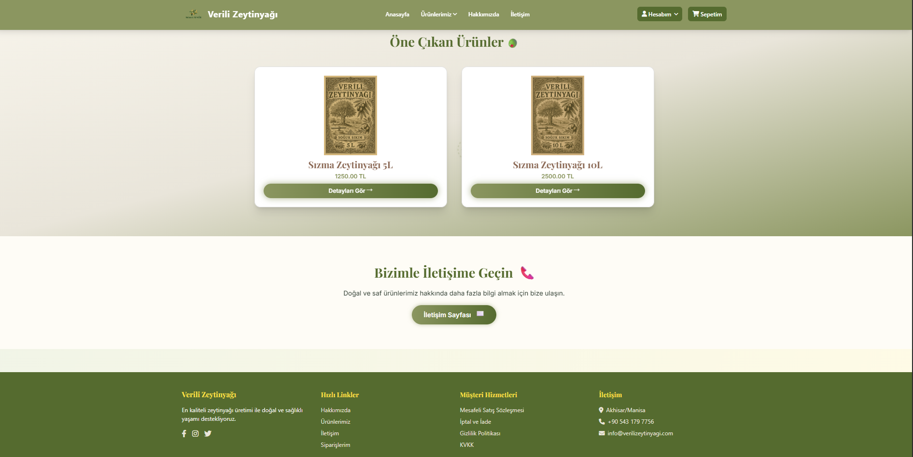

# Verili Zeytinyağı E-Ticaret Sitesi - App Showcase

Verili Zeytinyağı E-Ticaret Sitesi, kullanıcıların kolayca üye olup giriş yapabileceği, ürünleri inceleyip sepetine ekleyerek güvenli ödeme yöntemleriyle alışveriş yapabileceği bir altyapı sunar. Yönetim paneli üzerinden kullanıcılar, siparişler ve yorumlar etkin şekilde takip edilip yönetilebilir. Sistem; güvenli giriş, hızlı sipariş onayı ve detaylı raporlama özellikleriyle hem müşterilere hem de yöneticilere pratik bir deneyim sağlar. Modern tasarımı ve kullanıcı dostu arayüzü ile her ölçekte işletmeye uygun kapsamlı bir çözüm sunmaktadır.

---

## Özellikler

### Genel Özellikler
- Modern ve kullanıcı dostu arayüz
- Güvenli giriş ve kayıt sistemi
- Hızlı sipariş onayı
- Detaylı raporlama
- Responsive tasarım

### Kullanıcı Paneli
- Kayıt/Giriş sistemi
- Profil ve adres yönetimi
- Sipariş geçmişi
- Sepet yönetimi (Session tabanlı, dinamik güncelleme)
- Checkout ve sipariş onay sayfası

### Yönetim Paneli
- Dashboard
- Kullanıcı yönetimi ve detayları
- Sipariş yönetimi
- Gelir raporları
- Yorum/değerlendirme yönetimi

### Kullanıcı İstatistikleri
- Toplam kullanıcı sayısı
- Aktif/Deaktif kullanıcı durumu
- Admin kullanıcı sayısı
- Toplam harcama miktarı
- Kullanıcı aktivite durumu değiştirme

### Ürün Yönetimi
- Responsive ürün gösterimi

### Adres Sistemi
- Çoklu adres desteği
- Adres CRUD işlemleri

### Sepet Sistemi
- Session-based sepet yönetimi
- JavaScript ile dinamik güncelleme

### Sipariş Sistemi
- Checkout process
- Sipariş onay sayfası

### Gmail SMTP Entegrasyonu
- Gmail App Password kullanımı
- HTML email templates desteği
- Contact form email gönderimi

### KVKK ve Yasal Uyumluluk
- KVKK Aydınlatma Metni
- Gizlilik Politikası
- Çerez Politikası
- Kullanıcı Sözleşmesi
- Mesafeli Satış Sözleşmesi
- İptal ve İade Politikası
- Pazarlama İzinleri

---

## Teknik Detaylar

- Code-First approach
- Async/await patterns
- Entity Framework optimizations
- Caching considerations
- Session management

**Kullanılan Teknolojiler:**
- ASP.NET Core 8.0
- Entity Framework Core
- SQL Server
- Tailwind CSS
- JavaScript (Vanilla)

**Güvenlik:**
- ASP.NET Core Identity sistemi
- Role-based authorization (Admin, User rolleri)
- Anti-forgery tokens (CSRF koruması)
- Password hashing
- SSL/HTTPS zorunlu kullanım
- Input validation
- SQL Injection koruması (EF Core)

---

## Görseller

Kullanıcı ve yönetici paneline ait ekran görüntüleri aşağıda sunulmuştur:

Görselleri Göster

	
	
	
	
	
	
	
	
	
	
	
	
	
	
	
	

